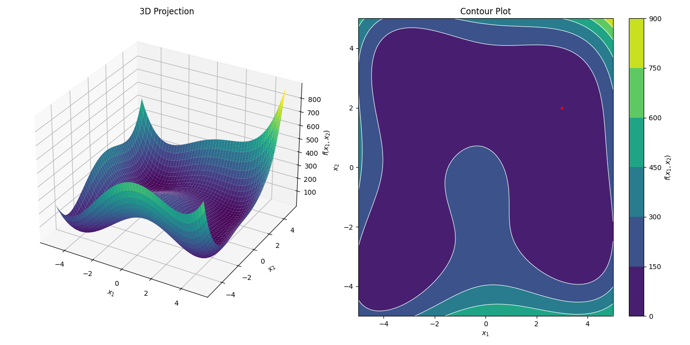
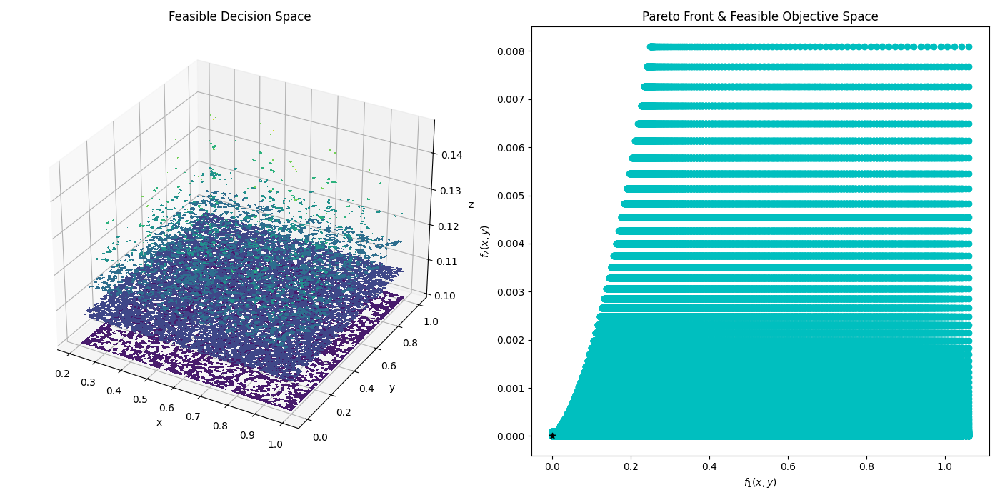
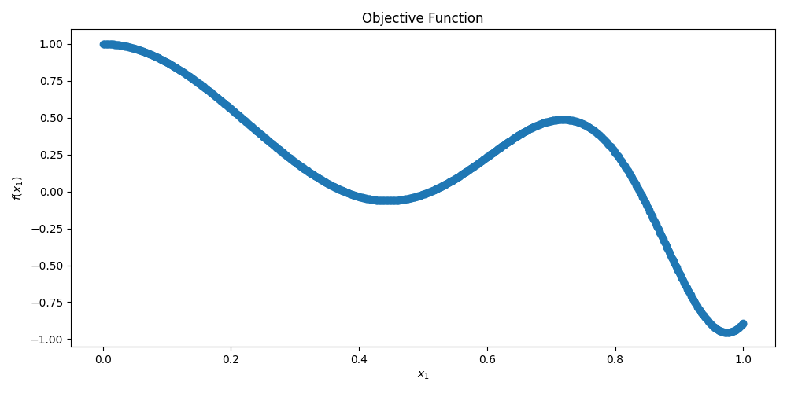

# 2022_improved_chicken_swarm_python

Improved chicken swarm optimizer written in Python. This is based off of the 2022 ICSO algorithm in [2]. Other updates to the algorithm will be posted as other branches.


Branch modified from [chicken swarm python](https://github.com/LC-Linkous/chicken_swarm_python) (main repo branch). Base structure modified from the [adaptive timestep PSO optimizer](https://github.com/jonathan46000/pso_python) by [jonathan46000](https://github.com/jonathan46000) to keep a consistent format across optimizers in AntennaCAT.


Now featuring AntennaCAT hooks for GUI integration and user input handling.

## Table of Contents
* [Chicken Swarm Optimization](#chicken-swarm-optimization)
* [Improved Chicken Swarm Optimization](#improved-chicken-swarm-optimization)
    * [Reproduction and Elimination-Dispersal (RECSO)](#reproduction-and-elimination-dispersal-recso)
    * [CSO-PSO Hybridization](#cso-pso-hybridization)
* [Requirements](#requirements)
* [Implementation](#implementation)
    * [Initialization](#initialization)
    * [State Machine-based Structure](#state-machine-based-structure)
    * [Importing and Exporting Optimizer State](#importing-and-exporting-optimizer-state)
    * [Constraint Handling](#constraint-handling)
    * [Boundary Types](#boundary-types)
    * [Multi-Objective Optimization](#multi-objective-optimization)
    * [Objective Function Handling](#objective-function-handling)
      * [Creating a Custom Objective Function](#creating-a-custom-objective-function)
      * [Internal Objective Function Example](#internal-objective-function-example)
    * [Target vs. Threshold Configuration](#target-vs-threshold-configuration)
* [Examples](#example-implementations)
    * [Basic Swarm Example](#basic-swarm-example)
    * [Detailed Messages](#detailed-messages)
    * [Realtime Graph](#realtime-graph)
* [References](#references)
* [Related Publications and Repositories](#related-publications-and-repositories)
* [Licensing](#licensing)

## Chicken Swarm Optimization

The Chicken Swarm Optimization (CSO) algorithm, introduced by Meng et al. in 2014 [1], is inspired by the hierarchy and behaviors observed in a swarm of chickens, including roosters, hens, and chicks. Each type of bird has its own unique movement rules and interactions.

In CSO, there is an absence of a direct random velocity component, which is an important distinction from many PSO variations, though it is not the only variation without a velocity vector. Instead, the movements are based on specific behaviors and social interactions within the swarm. Generally, the movement rules for each type of bird in CSO can be described as:

1) Roosters:

    Roosters have the best positions (fitness values) in the swarm. They move based on their current position and the random perturbation to avoid getting stuck in local optima.

2) Hens:

    Hens follow roosters. They update their positions based on the positions of the roosters they follow and a randomly selected chicken. This reflects the social hierarchy and interaction in the swarm.

3) Chicks:

    Chicks follow their mother hens. They update their positions based on their mother's positions with some random factor to simulate the dependent behavior.


## Improved Chicken Swarm Optimization

This implementation follows the 2022 Improved Chicken Swarm Optimization (ICSO) algorithm presented in [2]. Unlike the 2015 improved chicken swarm variant (which modifies the chick movement equation), the 2022 ICSO retains the **standard** CSO movement models for roosters, hens, and chicks, and instead adds two mechanisms on top of the base algorithm:

1) **RECSO**: reproduction and elimination-dispersal operations (inspired by the Bacterial Foraging Algorithm, BFA) applied to the chicks at each role update.
2) **CSO-PSO hybridization**: the population is randomly re-divided into two equal-scale subgroups every cycle, with one subgroup moving by the (RE)CSO role rules and the other moving by a standard PSO velocity-position update.

The chick movement retains the standard form (paper Eq. 6):

```
nextLoc = currentLoc + FL*(locationMother - currentLoc)
```

where FL is a following coefficient drawn uniformly from (0, 2). NOTE: other optimizers in the AntennaCAT chicken swarm family use a random choice of 0 or 2 for FL instead; the continuous draw here matches the paper, and the code comments note where to swap this to match the family behavior if preferred.

### Reproduction and Elimination-Dispersal (RECSO)

At each role update (the swarm reorganization that occurs every G full cycles), and skipped at the first role update when fitness-based roles have not yet been assigned, two operations are applied to the chicks **before** the swarm is re-ranked. The 'chicks' at this point are defined by the previous role assignment; because the previous reorganization left the swarm sorted from best to worst, the last CN entries are the chicks.

1) **Reproduction** (paper Eq. 7): each chick inherits the current position of one of the CN best-performing individuals in the swarm; collectively, the chicks are replaced with copies of the strongest individuals.

```
X_i(t+1) = X_(i-rNum-hNum)(t)
```

2) **Elimination-dispersal** (paper Eq. 8): each replicated chick is then scattered to a uniformly random in-bounds position in the search space with probability Ped (= 0.25 per the paper):

```
X = lb + (ub - lb)*rand
```

Framework adaptation note: the paper's Eq. 7 copies position only. This implementation also copies the source's personal best (so the fitness used by the re-ranking and movement formulas matches the inherited position) and resets the personal best of dispersed chicks (so they re-rank as unevaluated and explore from the new location instead of being pulled back by an inherited best).

### CSO-PSO Hybridization

At the start of every full cycle through the population, the swarm is randomly divided into two equal-scale subgroups (if the population size is odd, the extra particle stays in the CSO subgroup):

* **Subgroup 1** moves by the (RE)CSO role rules (rooster/hen/chick movement models).
* **Subgroup 2** moves by the standard PSO velocity-position update, using each particle's personal best and the swarm global best:

```
V = W*V + C1*rand*(Pb - X) + C2*rand*(Gb - X)
X = X + V
```

The PSO update **replaces** the CSO role move for particles in subgroup 2 for that cycle; it is not a refinement applied after it. Per the paper, C1 = C2 = 2. The paper does not specify an inertia weight; this implementation uses a linearly decreasing weight (W_max -> W_min over the run) as a framework choice for consistency with the AntennaCAT optimizer family.

Both subgroups share one population, one fitness record, and one global best, which realizes the paper's merge/information-exchange step implicitly.


## Requirements


This project requires numpy, pandas, and matplotlib for the full demos. To run the optimizer without visualization, only numpy and pandas are requirements

Use 'pip install -r requirements.txt' to install the following dependencies:

```python
contourpy==1.3.3
cycler==0.12.1
fonttools==4.63.0
kiwisolver==1.5.0
matplotlib==3.10.9
numpy==2.4.6
packaging==26.2
pandas==3.0.3
pillow==12.2.0
pyparsing==3.3.2
python-dateutil==2.9.0.post0
six==1.17.0
tzdata==2026.2

```

Optionally, requirements can be installed manually with:

```python
pip install  matplotlib, numpy, pandas

```
This is an example for if you've had a difficult time with the requirements.txt file. Sometimes libraries are packaged together.

## Implementation
### Initialization

```python
    # constant variables
    TOL = 10 ** -6                      # Convergence Tolerance
    MAXIT = 10000                       # Maximum allowed iterations
    BOUNDARY = 1                        # int boundary 1 = random,      2 = reflecting
                                        #              3 = absorbing,   4 = invisible

    # Objective function dependent variables
    LB = func_configs.LB                    # Lower boundaries, [[0.21, 0, 0.1]]
    UB = func_configs.UB                    # Upper boundaries, [[1, 1, 0.5]]
    IN_VARS = func_configs.IN_VARS          # Number of input variables (x-values)   
    OUT_VARS = func_configs.OUT_VARS        # Number of output variables (y-values)
    TARGETS = func_configs.TARGETS          # Target values for output

    # Objective function dependent variables
    func_F = func_configs.OBJECTIVE_FUNC  # objective function
    constr_F = func_configs.CONSTR_FUNC   # constraint function

        
    # chicken swarm specific
    RN = 10                       # Total number of roosters
    HN = 20                       # Total number of hens
    MN = 15                       # Number of mother hens in total hens
    CN = 20                       # Total number of chicks
    G = 70                        # Reorganize groups every G steps 

    # improved chicken swarm (2022 ICSO) specific
    MIN_WEIGHT = 0.4              # minimum PSO inertia weight
    MAX_WEIGHT = 0.9              # maximum (starting) PSO inertia weight
    C1 = 2                        # PSO cognitive learning factor (personal best)
    C2 = 2                        # PSO social learning factor (global best)
    PED = 0.25                    # elimination-dispersal probability, 0-1


    # swarm setup
    best_eval = 1

    parent = None            # for the PSO_TEST ONLY

    suppress_output = True   # Suppress the console output of particle swarm

    allow_update = True      # Allow objective call to update state 

    # Constant variables
    opt_params = {'BOUNDARY': [BOUNDARY],   # int boundary 1 = random,      2 = reflecting
                                            #              3 = absorbing,   4 = invisible
                'RN': [RN],                 # Total number of roosters
                'HN': [HN],                 # Total number of hens
                'MN': [MN],                 # Number of mother hens in total hens
                'CN': [CN],                 # Total number of chicks
                'G': [G],                   # Reorganize groups every G steps 
                'MIN_WEIGHT': [MIN_WEIGHT], # minimum PSO inertia weight
                'MAX_WEIGHT': [MAX_WEIGHT], # maximum (starting) PSO inertia weight
                'C1': [C1],                 # PSO cognitive learning factor
                'C2': [C2],                 # PSO social learning factor
                'PED': [PED]}               # elimination-dispersal probability

    opt_df = pd.DataFrame(opt_params)
    mySwarm = swarm(LB, UB, TARGETS, TOL, MAXIT,
                            func_F, constr_F,
                            opt_df,
                            parent=parent,
                            evaluate_threshold=False, obj_threshold=None,
                            decimal_limit = 4)   

    # arguments should take the form: 
    # swarm([[float, float, ...]], [[float, float, ...]], [[float, ...]], float, int,
    # func, func,
    # dataFrame,
    # class obj, 
    # bool, [int, int, ...], 
    # int) 
    #  
    # opt_df contains class-specific tuning parameters
    # boundary: int. 1 = random, 2 = reflecting, 3 = absorbing,   4 = invisible
    # RN: int
    # HN: int
    # MN: int
    # CN: int
    # G: int
    # w_min: float (PSO inertia weight, minimum)
    # w_max: float (PSO inertia weight, maximum/starting)
    # c1: float (PSO cognitive learning factor, personal best)
    # c2: float (PSO social learning factor, global best)
    # ped: float (elimination-dispersal probability, 0-1)
    #

```

### State Machine-based Structure

This optimizer uses a state machine structure to control the movement of the particles, call to the objective function, and the evaluation of current positions. The state machine implementation preserves the initial algorithm while making it possible to integrate other programs, classes, or functions as the objective function.

A controller with a `while loop` to check the completion status of the optimizer drives the process. Completion status is determined by at least 1) a set MAX number of iterations, and 2) the convergence to a given target using the L2 norm.  Iterations are counted by calls to the objective function. 

In this 2022 ICSO implementation, the random re-division of the swarm into the CSO and PSO subgroups happens at the start of every full cycle through the population (one full cycle through the population in this state-machine framework corresponds to one iteration of the paper's main loop). The reproduction and elimination-dispersal operations are applied as part of the swarm reorganization every G full cycles.

As a safety measure for the INVISIBLE boundary type, if every particle leaves the search space and goes inactive, the optimizer flags the stall and ends the run rather than letting the driver loop run forever.

Within this `while loop` are three function calls to control the optimizer class:
* **complete**: the `complete function` checks the status of the optimizer and if it has met the convergence or stop conditions.
* **step**: the `step function` takes a boolean variable (suppress_output) as an input to control detailed printout on current particle (or agent) status. This function moves the optimizer one step forward.  
* **call_objective**: the `call_objective function` takes a boolean variable (allow_update) to control if the objective function is able to be called. In most implementations, this value will always be true. However, there may be cases where the controller or a program running the state machine needs to assert control over this function without stopping the loop.

Additionally, **get_convergence_data** can be used to preview the current status of the optimizer, including the current best evaluation and the iterations.

The code below is an example of this process:

```python
    while not myOptimizer.complete():
        # step through optimizer processing
        # this will update particle or agent locations
        myOptimizer.step(suppress_output)
        # call the objective function, control 
        # when it is allowed to update and return 
        # control to optimizer
        myOptimizer.call_objective(allow_update)
        # check the current progress of the optimizer
        # iter: the number of objective function calls
        # eval: current 'best' evaluation of the optimizer
        iter, eval = myOptimizer.get_convergence_data()
        if (eval < best_eval) and (eval != 0):
            best_eval = eval
        
        # optional. if the optimizer is not printing out detailed 
        # reports, preview by checking the iteration and best evaluation

        if suppress_output:
            if iter%100 ==0: #print out every 100th iteration update
                print("Iteration")
                print(iter)
                print("Best Eval")
                print(best_eval)
```

### Importing and Exporting Optimizer State

Some optimizer information can be exported or imported. This varies based on each optimizer. For this optimizer, the exported state includes the PSO-related variables (velocity array, inertia weight, learning factors, subgroup flags) and the RECSO-related state (elimination-dispersal probability, whether a fitness-based role assignment has happened yet) in addition to the shared AntennaCAT format variables.

Optimizer state can be exported at any step. When importing an optimizer state, the optimizer should be initialized first, and then the state information can be imported via a Python pickle file. Other methods can be used if custom code is written to handle preprocessing.


Returning data from optimizer and saving to a .pkl file:
```python
    data = demo_optimizer.export_swarm()
    data_df = pd.DataFrame(data)
    print(data_df)
    data_df.to_pickle('output_data_df.pkl')

```


Importing data from a .pkl file and importing it into the optimizer:
```python
    data_df = pd.read_pickle('output_data_df.pkl') 
    demo_optimizer.import_swarm(data_df)

```


### Constraint Handling
Users must create their own constraint function for their problems, if there are constraints beyond the problem bounds.  This is then passed into the constructor. If the default constraint function is used, it always returns true (which means there are no constraints).

### Boundary Types
This optimizers has 4 different types of bounds, Random (Particles that leave the area respawn), Reflection (Particles that hit the bounds reflect), Absorb (Particles that hit the bounds lose velocity in that direction), Invisible (Out of bound particles are no longer evaluated).

Some updates have not incorporated appropriate handling for all boundary conditions.  This bug is known and is being worked on.  The most consistent boundary type at the moment is Random.  If constraints are violated, but bounds are not, currently random bound rules are used to deal with this problem. 

For the Invisible boundary type, two behaviors specific to this implementation are worth noting: 1) if every particle goes inactive, the optimizer ends the run early instead of hanging, and 2) the elimination-dispersal operation places dispersed chicks in-bounds and re-activates them, which gives Invisible boundary runs a natural revival mechanism at each role update.

### Multi-Objective Optimization
The no preference method of multi-objective optimization, but a Pareto Front is not calculated. Instead the best choice (smallest norm of output vectors) is listed as the output.

### Objective Function Handling
The objective function is handled in two parts. 


* First, a defined function, such as one passed in from `func_F.py` (see examples), is evaluated based on current particle locations. This allows for the optimizers to be utilized in the context of 1. benchmark functions from the objective function library, 2. user defined functions, 3. replacing explicitly defined functions with outside calls to programs such as simulations or other scripts that return a matrix of evaluated outputs. 

* Secondly, the actual objective function is evaluated. In the AntennaCAT set of optimizers, the objective function evaluation is either a `TARGET` or `THRESHOLD` evaluation. For a `TARGET` evaluation, which is the default behavior, the optimizer minimizes the absolute value of the difference of the target outputs and the evaluated outputs. A `THRESHOLD` evaluation includes boolean logic to determine if a 'greater than or equal to' or 'less than or equal to' or 'equal to' relation between the target outputs (or thresholds) and the evaluated outputs exist. 

Future versions may include options for function minimization when target values are absent. 


#### Creating a Custom Objective Function

Custom objective functions can be used by creating a directory with the following files:
* configs_F.py
* constr_F.py
* func_F.py

`configs_F.py` contains lower bounds, upper bounds, the number of input variables, the number of output variables, the target values, and a global minimum if known. This file is used primarily for unit testing and evaluation of accuracy. If these values are not known, or are dynamic, then they can be included experimentally in the controller that runs the optimizer's state machine. 

`constr_F.py` contains a function called `constr_F` that takes in an array, `X`, of particle positions to determine if the particle or agent is in a valid or invalid location. 

`func_F.py` contains the objective function, `func_F`, which takes two inputs. The first input, `X`, is the array of particle or agent positions. The second input, `NO_OF_OUTS`, is the integer number of output variables, which is used to set the array size. In included objective functions, the default value is hardcoded to work with the specific objective function.

Below are examples of the format for these files.

`configs_F.py`:
```python
OBJECTIVE_FUNC = func_F
CONSTR_FUNC = constr_F
OBJECTIVE_FUNC_NAME = "one_dim_x_test.func_F" #format: FUNCTION NAME.FUNCTION
CONSTR_FUNC_NAME = "one_dim_x_test.constr_F" #format: FUNCTION NAME.FUNCTION

# problem dependent variables
LB = [[0]]             # Lower boundaries
UB = [[1]]             # Upper boundaries
IN_VARS = 1            # Number of input variables (x-values)
OUT_VARS = 1           # Number of output variables (y-values) 
TARGETS = [0]          # Target values for output
GLOBAL_MIN = []        # Global minima sample, if they exist. 

```

`constr_F.py`, with no constraints:
```python
def constr_F(x):
    F = True
    return F
```

`constr_F.py`, with constraints:
```python
def constr_F(X):
    F = True
    # objective function/problem constraints
    if (X[2] > X[0]/2) or (X[2] < 0.1):
        F = False
    return F
```

`func_F.py`:
```python
import numpy as np
import time

def func_F(X, NO_OF_OUTS=1):
    F = np.zeros((NO_OF_OUTS))
    noErrors = True
    try:
        x = X[0]
        F = np.sin(5 * x**3) + np.cos(5 * x) * (1 - np.tanh(x ** 2))
    except Exception as e:
        print(e)
        noErrors = False

    return [F], noErrors
```


#### Internal Objective Function Example

There are three functions included in the repository:
1) Himmelblau's function, which takes 2 inputs and has 1 output
2) A multi-objective function with 3 inputs and 2 outputs (see lundquist_3_var)
3) A single-objective function with 1 input and 1 output (see one_dim_x_test)

Each function has four files in a directory:
   1) configs_F.py - contains imports for the objective function and constraints, CONSTANT assignments for functions and labeling, boundary ranges, the number of input variables, the number of output values, and the target values for the output
   2) constr_F.py - contains a function with the problem constraints, both for the function and for error handling in the case of under/overflow. 
   3) func_F.py - contains a function with the objective function.
   4) graph.py - contains a script to graph the function for visualization.

Other multi-objective functions can be applied to this project by following the same format (and several have been collected into a compatible library, and will be released in a separate repo)

<p align="center">
        
</p>
   <p align="center">Plotted Himmelblau’s Function with 3D Plot on the Left, and a 2D Contour on the Right</p>

```math
f(x, y) = (x^2 + y - 11)^2 + (x + y^2 - 7)^2
```

| Global Minima | Boundary | Constraints |
|----------|----------|----------|
| f(3, 2) = 0                 | $-5 \leq x,y \leq 5$  |   | 
| f(-2.805118, 3.121212) = 0  | $-5 \leq x,y \leq 5$  |   | 
| f(-3.779310, -3.283186) = 0 | $-5 \leq x,y \leq 5$  |   | 
| f(3.584428, -1.848126) = 0  | $-5 \leq x,y \leq 5$   |   | 

<p align="center">
        
</p>
   <p align="center">Plotted Multi-Objective Function Feasible Decision Space and Objective Space with Pareto Front</p>

```math
\text{minimize}: 
\begin{cases}
f_{1}(\mathbf{x}) = (x_1-0.5)^2 + (x_2-0.1)^2 \\
f_{2}(\mathbf{x}) = (x_3-0.2)^4
\end{cases}
```

| Num. Input Variables| Boundary | Constraints |
|----------|----------|----------|
| 3      | $0.21\leq x_1\leq 1$ <br> $0\leq x_2\leq 1$ <br> $0.1 \leq x_3\leq 0.5$  | $x_3\gt \frac{x_1}{2}$ or $x_3\lt 0.1$| 

<p align="center">
        
</p>
   <p align="center">Plotted Single Input, Single-objective Function Feasible Decision Space and Objective Space with Pareto Front</p>

```math
f(\mathbf{x}) = sin(5 * x^3) + cos(5 * x) * (1 - tanh(x^2))
```
| Num. Input Variables| Boundary | Constraints |
|----------|----------|----------|
| 1      | $0\leq x\leq 1$  | $0\leq x\leq 1$| |

Local minima at $(0.444453, -0.0630916)$

Global minima at $(0.974857, -0.954872)$

### Target vs. Threshold Configuration

An April 2025 feature is the user ability to toggle TARGET and THRESHOLD evaluation for the optimized values. The key variables for this are:

```python
# Boolean. use target or threshold. True = THRESHOLD, False = EXACT TARGET
evaluate_threshold = True  

# array
TARGETS = func_configs.TARGETS    # Target values for output from function configs
# OR:
TARGETS = [0,0,0] #manually set BASED ON PROBLEM DIMENSIONS

# threshold is same dims as TARGETS
# 0 = use target value as actual target. value should EQUAL target
# 1 = use as threshold. value should be LESS THAN OR EQUAL to target
# 2 = use as threshold. value should be GREATER THAN OR EQUAL to target
#DEFAULT THRESHOLD
THRESHOLD = np.zeros_like(TARGETS) 
# OR
THRESHOLD = [0,1,2] # can be any mix of TARGET and THRESHOLD  
```

To implement this, the original `self.Flist` objective function calculation has been replaced with the function `objective_function_evaluation`, which returns a numpy array.

The original calculation:
```python
self.Flist = abs(self.targets - self.Fvals)
```
Where `self.Fvals` is a re-arranged and error checked returned value from the passed in function from `func_F.py` (see examples for the internal objective function or creating a custom objective function). 

When using a THRESHOLD, the `Flist` value corresponding to the target is set to epsilon (the smallest system value) if the evaluated `func_F` value meets the threshold condition for that target item. If the threshold is not met, the absolute value of the difference of the target output and the evaluated output is used. With a THRESHOLD configuration, each value in the numpy array is evaluated individually, so some values can be 'greater than or equal to' the target while others are 'equal' or 'less than or equal to' the target. 


## Example Implementations

### Basic Swarm Example
`main_test.py` provides a sample use case of the optimizer. 

### Detailed Messages
`main_test_details.py` provides an example using a parent class, and the self.suppress_output flag to control error messages that are passed back to the parent class to be printed with a timestamp. This implementation sets up the hooks for integration with AntennaCAT in order to provide the user feedback of warnings and errors.

### Realtime Graph

<p align="center">
        
</p>

`main_test_graph.py` provides an example using a parent class, and the self.suppress_output flag to control error messages that are passed back to the parent class to be printed with a timestamp. Additionally, a realtime graph shows particle locations at every step. 

NOTE: if you close the graph as the code is running, the code will continue to run, but the graph will not re-open.

## References

[1] X. B. Meng, Y. Liu, X. Gao, and H. Zhang, "A new bio-inspired algorithm: Chicken swarm optimization," in Proc. Int. Conf. Swarm Intell. Cham, Switzerland, Springer, 2014, pp. 86–94.

[2] J. Liang, L. Wang, and M. Ma, "An Improved Chicken Swarm Optimization Algorithm for Solving Multimodal Optimization Problems," Computational Intelligence and Neuroscience, vol. 2022, Article ID 5359732, 2022. https://doi.org/10.1155/2022/5359732

## Related Publications and Repositories
This software works as a stand-alone implementation, and as one of the optimizers integrated into AntennaCAT.


## Licensing

The code in this repository has been released under GPL-2.0